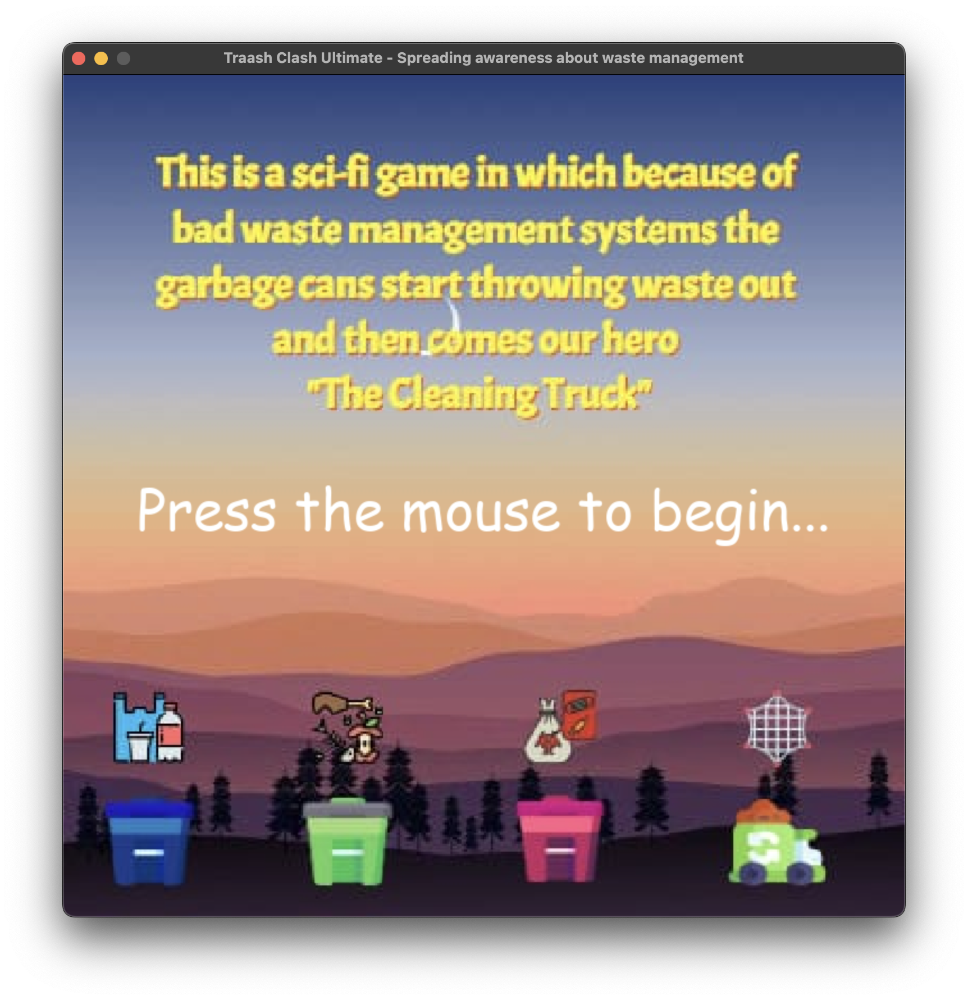
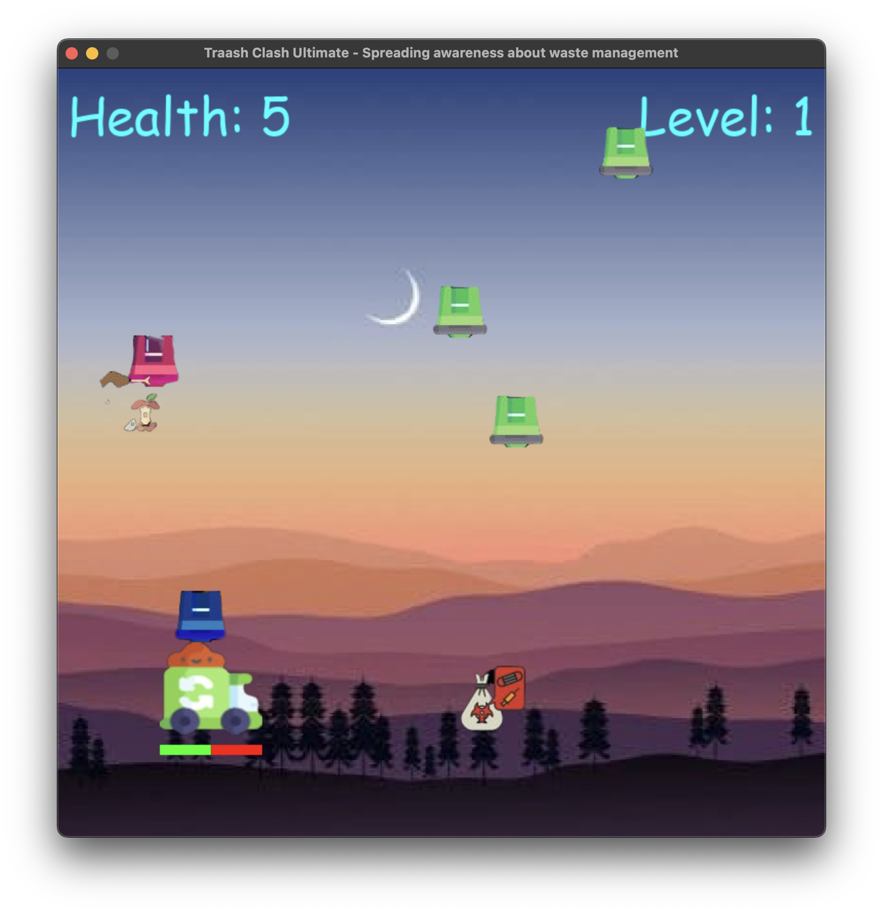

# TrashTracker

TrashTracker is an exciting Python game built with Pygame, where you take on the role of a vigilant cleaning truck tasked with capturing mischievous trash cans and saving the city from garbage chaos!

## Table of Contents

- [Game Overview](#game-overview)
- [Features](#features)
- [Getting Started](#getting-started)
- [Installation](#installation)
- [Game Controls](#game-controls)
- [How to Play](#how-to-play)
- [Screenshots](#screenshots)
- [Contributing](#contributing)
- [License](#license)

## Game Overview

In TrashTracker, you control a cleaning truck equipped with a net to capture trash cans that throw garbage at your vehicle. The cleaning truck has a health meter that depletes when hit by trash. Trash cans come in three colors: red, blue, and green, each with unique behavior. You must move your truck using the W, A, S, and D keys and dispense the net using the spacebar. The game features an engaging intro screen with instructions and background music playing throughout. As you progress through levels, you'll face waves of trash can enemies, and the challenge intensifies.

## Features

- Interactive Pygame-based gameplay.
- Multiple levels with increasing difficulty.
- Trash cans with unique behavior and colors.
- Health meter for the cleaning truck.
- Captivating intro screen with instructions.
- Background music to enhance the gaming experience.

## Getting Started

To get started with TrashTracker, follow the installation steps below.

## Installation

1. Clone the repository to your local machine using the following command:

   ```bash
   git clone https://github.com/your-username/TrashTracker.git
   ```

2. Navigate to the project directory:

   ```bash
   cd TrashTracker
   ```

3. Create a virtual environment (recommended):

   ```bash
   python -m venv venv
   ```

4. Activate the virtual environment:

   - On macOS and Linux:

     ```bash
     source venv/bin/activate
     ```

   - On Windows (PowerShell):

     ```bash
     .\venv\Scripts\Activate
     ```

5. Install the required dependencies:

   ```bash
   pip install -r requirements.txt
   ```

## Game Controls

- **W, A, S, D**: Move the cleaning truck.
- **Spacebar**: Dispense the net to capture trash cans.

## How to Play

1. Launch the game by running the following command in your terminal:

   ```bash
   python tuc.py
   ```

2. Follow the on-screen instructions to learn how to play and navigate through the levels.

3. Capture all trash cans to progress and save the city from garbage chaos!

## Screenshots




## Contributing

Contributions to TrashTracker are welcome! Feel free to open issues or submit pull requests for bug fixes, enhancements, or new features.

## License

This project is licensed under the [MIT License](LICENSE).
